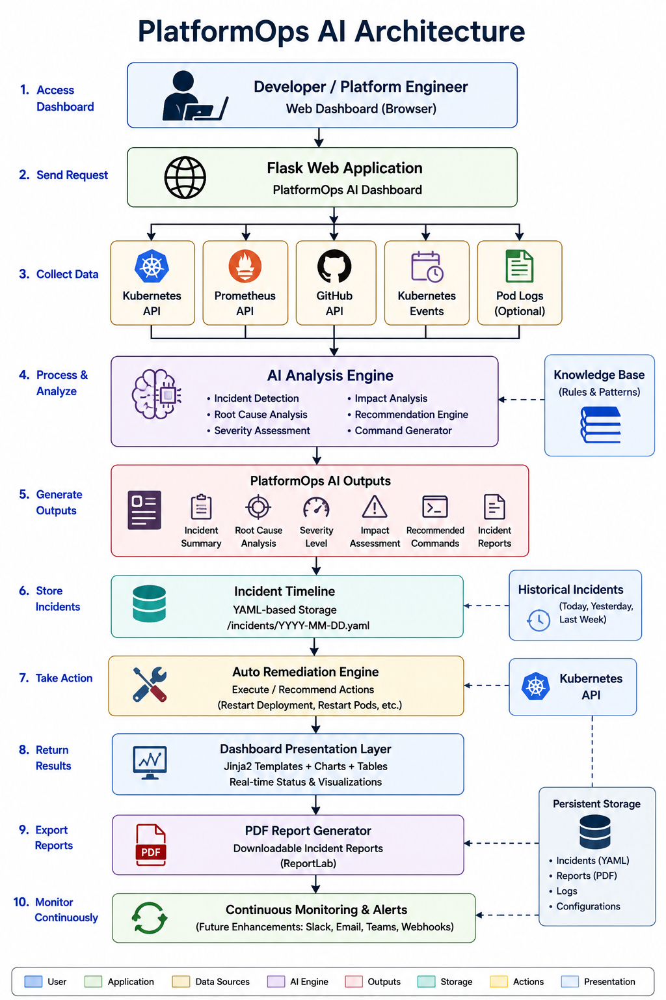

# PlatformOps AI



> **An AI-powered Kubernetes Operations Dashboard that monitors cluster health, investigates infrastructure issues, performs root cause analysis, generates incident reports, and assists with Kubernetes remediation.**

---


---

# Overview

PlatformOps AI is an AI-powered DevOps platform built to simplify Kubernetes operations.

Instead of manually switching between **kubectl**, **Prometheus**, **GitHub**, and Kubernetes Events, PlatformOps AI collects cluster information, performs AI-powered investigations, identifies infrastructure problems, evaluates severity, recommends remediation commands, and presents everything through a single dashboard.

The project demonstrates practical Platform Engineering, Site Reliability Engineering (SRE), Kubernetes Operations, Infrastructure Monitoring, and AI-assisted Incident Response.

---

#  Features

##  Kubernetes Monitoring

Monitor:

- Pods
- Deployments
- Services
- Nodes
- Namespaces
- Kubernetes Events

---

##  Cluster Health Dashboard

Displays:

- Overall Health Score
- Healthy Pods
- Failed Pods
- Deployment Status
- Infrastructure Health

---

##  AI Deployment Investigation

Automatically detects unhealthy deployments and generates:

- Issue Summary
- Evidence
- Business Impact
- Severity
- Recommended kubectl Commands

Example:

```
Issue

Grafana deployment unavailable

Evidence

Ready Replicas: 0/1

Deployment unavailable

Impact

Monitoring is unavailable.

Severity

HIGH

Recommendation

kubectl rollout restart deployment monitoring-grafana -n monitoring
```

---

##  AI Root Cause Analysis

PlatformOps AI analyzes Kubernetes resources and explains why workloads are unhealthy.

Detects issues such as:

- CrashLoopBackOff
- ImagePullBackOff
- Failed Deployments
- Unhealthy Pods
- Readiness Probe Failures
- Resource Exhaustion

---

##  Incident Investigation

Each incident includes:

- Root Cause
- Severity
- Business Impact
- AI Confidence
- Evidence
- Recommended Commands

---

##  Incident Timeline

Historical timeline of Kubernetes incidents.

Example:

```
Pod Scheduled

↓

Container Started

↓

Readiness Probe Failed

↓

CrashLoopBackOff

↓

AI Investigation

↓

Deployment Restarted
```

---

## 📄 Incident Report Generation

Generate professional incident summaries containing:

- Deployment
- Root Cause
- Severity
- Impact
- Investigation Details
- Recommended Resolution

---

##  Auto Remediation

Supports automated recovery actions including:

- Restart Deployment
- Suggested kubectl Commands
- Recovery Recommendations

---

## 📈 Prometheus Monitoring

Collects live metrics including:

- CPU Usage
- Memory Usage
- Network Usage
- Cluster Utilization

---

##  GitHub Integration

Displays:

- Latest Commit
- Commit Author
- Commit Date
- Commit Message

Useful for correlating deployments with infrastructure incidents.

---

# 🏗️ Architecture

PlatformOps AI follows an end-to-end AI-driven incident response workflow. It continuously collects Kubernetes cluster data, correlates infrastructure metrics and events, performs AI-powered root cause analysis, generates incident reports, stores historical incidents, and provides automated remediation through a unified web dashboard.

<p align="center">
    
</p>

## Architecture Flow

```text
                👨‍💻 Platform Engineer
                        │
                        │ 1. Analyze Cluster
                        ▼
                 🌐 Flask Web Dashboard
                        │
                        ▼
          ☸️ Kubernetes Python Client
                        │
        ┌───────────────┼────────────────┐
        │               │                │
        ▼               ▼                ▼
     Kubernetes     Prometheus      GitHub API
      Resources        Metrics       Deployment Info
        │               │                │
        └───────────────┼────────────────┘
                        ▼
               🤖 PlatformOps AI Engine
                        │
      ┌─────────────────┼──────────────────┐
      │                 │                  │
      ▼                 ▼                  ▼
 Deployment      Root Cause Analysis   Health Engine
Investigation         & Severity
      │                 │                  │
      └─────────────────┼──────────────────┘
                        ▼
          📋 Incident Report Generator
                        │
                        ▼
            📁 Incident Timeline (YAML)
                        │
                        ▼
             ⚡ Auto Repair Engine
                        │
                        ▼
             📊 PlatformOps AI Dashboard
```

## Architecture Components

### 👨‍💻 Platform Engineer

Starts an investigation from the web dashboard by asking questions such as:

- Why is my application down?
- Why are Pods restarting?
- Which deployment failed?

### 🌐 Flask Dashboard

Provides a single interface for:

- Cluster Health
- AI Investigation
- Incident Timeline
- Kubernetes Resources
- Prometheus Metrics
- GitHub Activity
- Auto Remediation

### ☸️ Kubernetes Collector

Collects live information from the cluster including:

- Pods
- Deployments
- Services
- Nodes
- Namespaces
- Events

### 📈 Prometheus Integration

Retrieves infrastructure metrics such as:

- CPU Usage
- Memory Usage
- Network Usage
- Cluster Utilization

### 🔄 GitHub Integration

Correlates deployments with code changes by retrieving:

- Latest Commit
- Commit Author
- Commit Date
- Commit Message

### 🤖 AI Investigation Engine

Automatically detects infrastructure problems including:

- CrashLoopBackOff
- Failed Deployments
- ImagePullBackOff
- High Restart Counts
- Service Failures
- Resource Exhaustion

The AI determines:

- Root Cause
- Severity
- Business Impact
- Recommended kubectl Commands

### 📋 Incident Report Generator

Creates structured AI-generated reports containing:

- Executive Summary
- Root Cause
- Supporting Evidence
- Severity
- Business Impact
- Recommended Actions

### 📁 Incident Timeline

Stores investigations as YAML files for historical tracking.

Each incident includes:

- Timestamp
- Root Cause
- Status
- Repair Action
- Resolution History

### ⚡ Automated Repair

Supports automated Kubernetes recovery actions including:

- Restart Deployment
- Restart Pods
- Rollout Restart
- Suggested kubectl Commands

### 📊 Unified Dashboard

Displays everything in one place:

- Cluster Health Score
- AI Investigations
- Deployment Status
- Kubernetes Events
- Prometheus Metrics
- GitHub Activity
- Incident Timeline
- Auto Repair

## End-to-End Workflow

1. User starts an analysis from the dashboard.
2. PlatformOps AI collects Kubernetes resources.
3. Prometheus metrics are retrieved.
4. GitHub deployment information is collected.
5. AI investigates unhealthy deployments.
6. Root cause analysis is generated.
7. Severity is calculated.
8. Incident reports are generated.
9. Incidents are stored for historical tracking.
10. Auto-remediation commands are suggested or executed.
11. Results are displayed in the dashboard.

---

#  Dashboard Workflow

```
User

   │

   ▼

PlatformOps AI Dashboard

   │

   ▼

Collect Kubernetes Resources

   │

   ├── Pods

   ├── Deployments

   ├── Services

   ├── Nodes

   ├── Namespaces

   └── Events

   │

   ▼

Prometheus Metrics

   │

   ▼

AI Investigation Engine

   │

   ├── Incident Detection

   ├── Root Cause Analysis

   ├── Severity Assessment

   ├── Business Impact

   ├── Recommended kubectl Commands

   └── Incident Report Generation

   │

   ▼

Incident Timeline

   │

   ▼

Auto Remediation
```

---

# 🛠 Tech Stack

### Backend

- Python
- Flask

### Kubernetes

- Kubernetes Python Client
- kubectl
- Minikube

### Monitoring

- Prometheus

### AI

- Custom AI Investigation Engine

### Frontend

- HTML
- CSS
- Jinja2

### Reports

- YAML
- Report Generator

### DevOps

- Docker
- Git
- GitHub

---

#  Project Structure

```
platformops-ai/

├── app/
│   ├── ai/
│   │   ├── investigation.py
│   │   ├── report_generator.py
│   │   ├── root_cause.py
│   │   ├── recommendation.py
│   │   ├── severity.py
│   │   └── timeline.py
│   │
│   ├── templates/
│   ├── static/
│   ├── main.py
│   ├── events.py
│   ├── github_service.py
│   ├── health.py
│   ├── k8s_service.py
│   ├── prometheus.py
│   ├── repair.py
│   └── severity.py
│
├── incidents/
├── k8s/
├── screenshots/
├── Dockerfile
├── docker-compose.yml
├── requirements.txt
└── README.md
```

---

#  Installation

```bash
git clone https://github.com/feranzeey/platformops-ai.git

cd platformops-ai
```

Create a virtual environment.

```bash
python -m venv venv
```

Windows

```bash
venv\Scripts\activate
```

Linux

```bash
source venv/bin/activate
```

Install dependencies.

```bash
pip install -r requirements.txt
```

Run the application.

```bash
cd app

python main.py
```

Open:

```
http://localhost:5000
```

---

# 🐳 Docker

Build

```bash
docker build -t platformops-ai .
```

Run

```bash
docker run -p 5000:5000 platformops-ai
```

---

#  Kubernetes Deployment

```bash
kubectl apply -f k8s/
```

Verify

```bash
kubectl get pods

kubectl get svc
```

---

#  Screenshots

## PlatformOps AI Dashboard


---

## Cluster Health Dashboard


---

## AI Deployment Investigation


---

## Cluster Summary


---

## Kubernetes Deployments


---

## Kubernetes Events


---

## Prometheus Metrics


---

## Active Incident Analysis


---

## Incident Timeline


---

## Auto Remediation


---

## GitHub Integration


---

## Platform Architecture


---

#  Demo

Suggested walkthrough:

- Cluster Health
- AI Investigation
- Root Cause Analysis
- Incident Timeline
- Auto Remediation
- Prometheus Metrics
- GitHub Integration

Estimated duration: **2–3 minutes**

---

#  Future Improvements

- Multi-Cluster Support
- AI Chat Assistant
- Helm Chart
- GitHub Actions CI/CD
- Slack Notifications
- Microsoft Teams Alerts
- Email Notifications
- Predictive Failure Detection
- Role-Based Access Control (RBAC)
- Grafana Integration
- One-Click Safe Auto Repair

---

#  Learning Outcomes

This project demonstrates experience with:

- Kubernetes
- Docker
- Flask
- Python
- DevOps
- Platform Engineering
- Infrastructure Monitoring
- Observability
- Incident Response
- AI-assisted Operations
- Prometheus
- GitHub API
- YAML
- REST APIs

---

#  Contributing

Contributions are welcome.

1. Fork the repository.
2. Create a feature branch.
3. Commit your changes.
4. Push your branch.
5. Open a Pull Request.

---

#  License

This project is licensed under the MIT License.

---

#  Author

**Oluwaferanmi Dada**

DevOps Engineer | Platform Engineering | Kubernetes | Docker | Python | CI/CD | Cloud Infrastructure

GitHub: https://github.com/feranzeey

LinkedIn: https://www.linkedin.com/in/your-linkedin-profile

---

##  Support

If you found this project helpful, consider giving it a **Star** on GitHub.